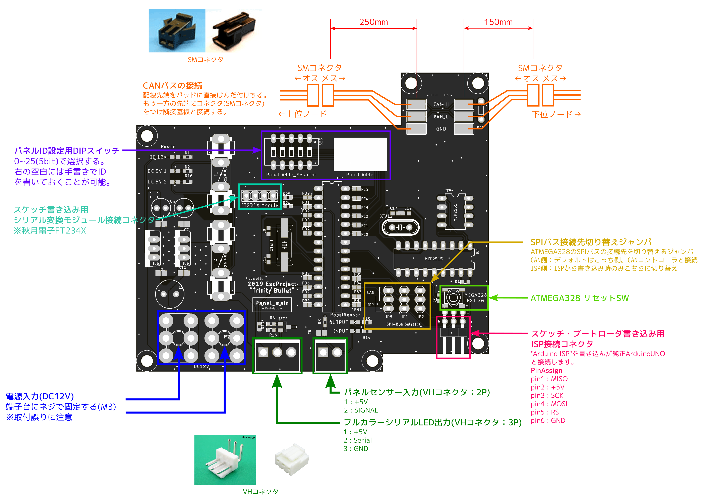

2019 Esc「Trinity Bullet」 
基板仕様書

<!-- 基板名 -->
<h1>

HPTLDB 

- HP gauge and Time Limit Display Board -

</h1>

<!-- 日付＆改版＆名前 -->

基板担当

 
<!-- レンダリング画像 -->

## 概要
HPTLDB(HP gauge and Time Limit Display Board)基板には、HPゲージおよび制限時間の表示器が搭載されます。Panel_MASTER基板に搭載されたESP32から送信されるデータにより、HPと制限時間を表示します。

## 特徴
1.  Panel_MASTER基板との通信プロトコルにはI2Cを採用しました。I2Cは長距離通信を苦手としているため、高ドライブ電流I2Cバスバッファ"PCA9600D"を搭載。Panel_MASTER基板とパネルの距離が長くなった場合でも安定した通信が可能です。(基板間の接続にはLANケーブルを使用する。)
 

## 詳細

###ブロック図

###ピンアサイン
- Arduino Nano (AVR ATmega328)

| AVR       | Arduino   | function              |
|:---------:|:---------:|:-------------         |
| PD2       |  2        | CLK : TM1637          |
| PD3       |  3        | DIO : TM1637          |
| PD6       |  6        | NeoPixcel             |
| PC4       | A4        | SDA : I2C             |
| PC5       | A5        | SCL : I2C             |

<!--

###寸法

- 基板高さ : 未定

###接続

-->