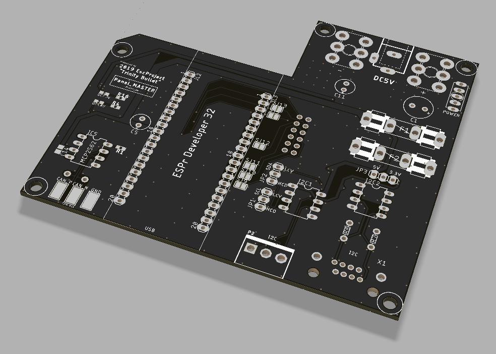
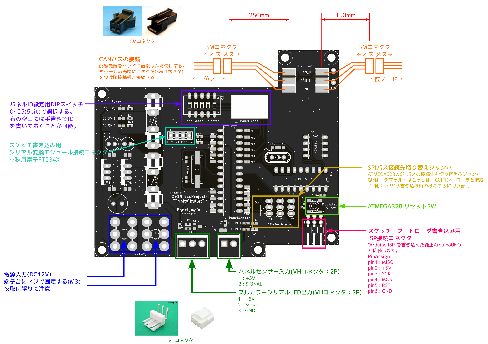

2019 Esc「Trinity Bullet」 
基板仕様書

<!-- 基板名 -->
<h1>

Panel_MASTER 

</h1>

<!-- 日付＆改版＆名前 -->

基板担当

 
<!-- レンダリング画像 -->

## 概要
Panel_MASTER基板はパネル、HPゲージ・時間表示パネル(仮)といったTrinityBulletを構成する各種ハードウェアの制御およびPCとの通信を行います。

## 特徴
1.  Wi-Fi、Bluetooth搭載の高性能マイコン"ESP32"を搭載し、25枚のパネル、HPゲージ・時間表示パネル(仮)等の制御を行います。また、Wi-Fiを使用してPCとのデータ送受信を行います。
    - 使用マイコンボード：ESPr Developer32 (スイッチサイエンス)
 
2.  Panel_MASTER基板と各Panel_main基板との通信プロトコルには耐ノイズ性に優れたCANを採用しました。
    - CANトランシーバIC：MCP2562
 
3.  Panel_MASTER基板とHPゲージ・時間表示パネル(仮)との通信プロトコルにはI2Cを採用しました。HPゲージ・時間表示パネル(仮)に使用するマイコン(AVR)がDC5V系のため、3.3V-5.0Vのレベル変換ICを搭載しました。
更に、高ドライブ電流I2Cバスバッファ"PCA9600D"を選択可能。Panel_MASTER基板とパネルの距離が長くなった場合でも安定した通信が可能です(基板間の接続にはLANケーブルを使用する。)
 
4.  未使用のGPIOを引き出しており、機能が増えた際に基板を拡張することが可能です。

## 詳細

###回路図
-別紙参照-

###ピンアサイン
- ESP32

| ESP32     | function         |
|:---------:|:---------        |
| IO25      | CAN : CAN_P      |
| IO26      | CAN : CAN_N      |
| IO21      | I2C : SDA        |
| IO22      | I2C : SCL        |

###寸法

- 基板高さ : 未定

###接続

