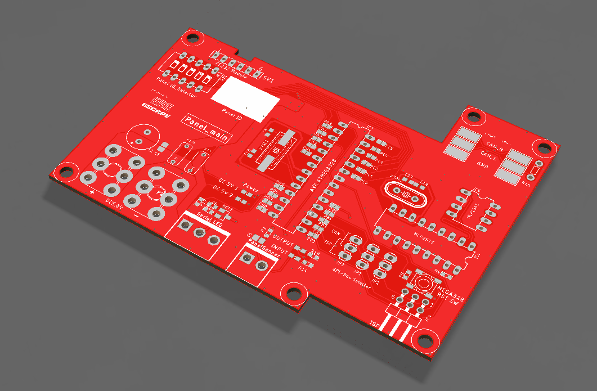
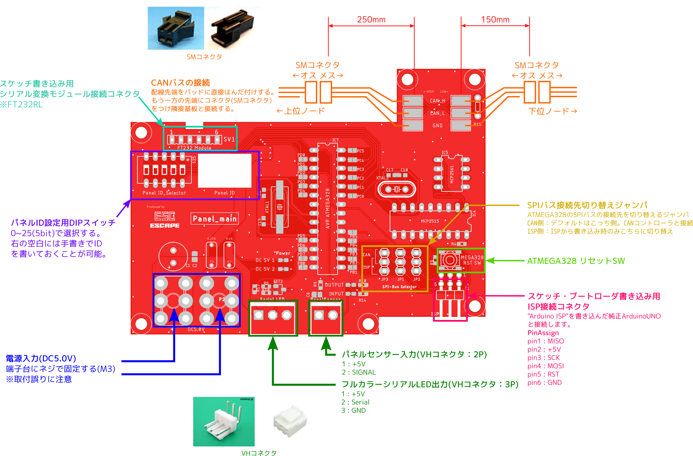

2019 Esc「Trinity Bullet」 
基板仕様書

<!-- 基板名 -->
<h1>

Panel_main 

</h1>

<!-- 日付＆改版＆名前 -->

基板担当

 
<!-- レンダリング画像 -->

## 概要
Panel_main基板は、25枚のパネルにそれぞれ1つづつ搭載されます。本基板では各パネルの照明用シリアルLEDの制御、パネル踏み込みの検出が可能です。

## 特徴
1.  マイコンはArduinoUNOとの互換性を持ち、Arduinoで開発が可能です。プログラム書き込みには「FT232RL USBシリアル変換モジュール」またはISPピン("Arduino ISP"を書き込んだ純正ArduinoUNOを接続)を使用します。
    - 使用マイコン：ATmega328 (Arduinoとして使用。外部クロック16MHz)
 
2.  Panel_MASTER基板と各Panel_main基板との通信プロトコルには耐ノイズ性に優れたCANを採用しました。
    - CANコントローラIC：MCP2515　(8MHz)
    - CANトランシーバIC：MCP2561
 
3. センサー入力回路にヒステリシスコンパレータ回路を採用。パネルセンサーの動作安定性の向上を目指しました。
## 詳細
### プロトタイプからの主な変更点
1.  電源入力をDC12VからDC5Vに変更。プロトタイプでは本基板1枚毎に載っていた3端子レギュレータによってDC5V電源を作り出していましたが、専用電源基板にパネル数枚分のDC5V電源をまとめることでコストダウンを図りました。
 
2.  基板サイズを変更し、よりコンパクトになりました。
 
3.  CANコントローラの誤配線を修正しました。(サンプルスケッチにて動作確認済み)
 
4.  ATMEGA328のリセットボタンの誤配線を修正しました。
 
5.  ATMEGA328書き込み用のシリアル変換モジュールをDTR(リセットピン)付のものに変更。また、コネクタ差し込み向き間違い防止のための機構を作成予定。

###回路図
-別紙参照-

###ピンアサイン
- ATMEGA328

| AVR       | Arduino   | function              |
|:---------:|:---------:|:-------------         |
| PB1       |  9        | INT  : CAN            |
| PB2       | 10        | SS   : CAN            |
| PB3       | 11        | MOSI : CAN, ISP       |
| PB4       | 12        | MISO : CAN, ISP       |
| PB5       | 13        | SCK  : CAN, ISP       |
| PC0       | A0        | Panel ID : bit0 (LSB) |
| PC1       | A1        | Panel ID : bit1       |
| PC2       | A2        | Panel ID : bit2       |
| PC3       | A3        | Panel ID : bit3       |
| PC4       | A4        | Panel ID : bit4 (MSB) |
| PD0       |  0        | RXD                   |
| PD1       |  1        | TXD                   |
| PD2       |  2        | PanelSensor           |
| PB6       |  6        | SerialLED             |

###寸法

- 基板高さ : 約25mm (基板固定用シャシー含む)

###接続

